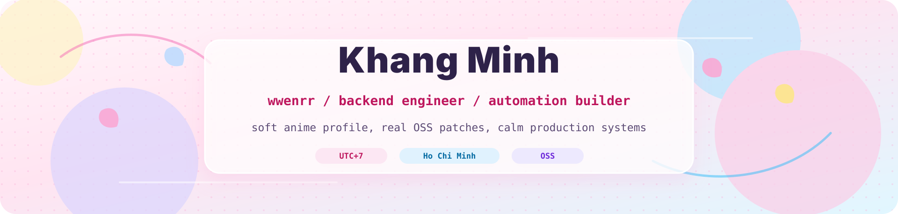

<div align="center">
  
</div>

<br />

<div align="center">
  <a href="https://github.com/wwenrr">
    
  </a>
</div>

<div align="center">
  <a href="https://github.com/wwenrr?tab=followers">
    
  </a>
  
  
  
</div>

<br />

---

<h2 align="center">Mission Board</h2>

<table align="center" width="100%">
<tr>
<td valign="top" width="50%">

### Who I Am

I am **MK / Khang Minh**, a backend-focused builder based in Ho Chi Minh.

I like systems that are calm under pressure: APIs, automation, internal tools, CI/CD, data workflows, and the small fixes that make daily engineering less painful.

```txt
profile    backend engineer, automation builder, OSS contributor
style      practical, readable, production-first
timezone   UTC+7
handle     wwenrr
```

</td>
<td valign="top" width="50%">

### Current Quest

- Building agent and automation tooling with practical production paths
- Improving backend reliability across TypeScript, Ruby, Go, Python, and C#
- Contributing small, reviewable patches to established OSS projects
- Turning repeated manual workflows into observable, maintainable systems

### Operating Style

- Ship narrow changes with clear evidence
- Prefer boring reliability over clever surprises
- Keep code reviewable, testable, and easy to roll back
- Document decisions where future maintainers will look first

</td>
</tr>
</table>

<br />

---

<h2 align="center">Open Source Contribution Log</h2>

<p align="center">
  Merged patches across ecosystem projects including Rails, Next.js, NestJS, Sinatra, Capybara, Lark CLI, and developer tooling.
</p>

<div align="center">

| Area | Repositories | Contribution Shape |
|---|---|---|
| Ruby / Web | Rails, Sinatra, Capybara | docs fixes, assertion behavior, framework polish |
| TypeScript / Node | Next.js, NestJS, Nest CLI, Lark CLI | docs clarity, peer dependency fixes, CLI validation |
| Agent Tooling | oh-my-codex, oh-my-claudecode, codex-keyring | workflow correctness, tests, error classification |
| Data / Infra | goclaw | SQL placeholder correctness and reliability fixes |

</div>

<!-- OPEN_SOURCE_OPEN_PRS:START -->
<div align="center">
  
  
</div>

<br />

<div align="center">
<details>
<summary><b>Recent Merged PRs</b></summary>

<br />

| Repo | PR | Title | Merged Date |
|---|---|---|---|
| sinatra/sinatra | [#2155](https://github.com/sinatra/sinatra/pull/2155) | docs: replace dead Sinatra book link in contributing guide | 2026-07-08 |
| sinatra/sinatra | [#2158](https://github.com/sinatra/sinatra/pull/2158) | docs: add more Rack::Protection usage examples | 2026-07-08 |
| teamcapybara/capybara | [#2835](https://github.com/teamcapybara/capybara/pull/2835) | Fix Node#assert_text assertion counting in Minitest | 2026-07-07 |
| rails/rails | [#57122](https://github.com/rails/rails/pull/57122) | railties: fix misleading production cache store comment | 2026-05-07 |
| larksuite/cli | [#256](https://github.com/larksuite/cli/pull/256) | fix(docs): validate --selection-by-title format early | 2026-04-21 |
| vercel/next.js | [#92232](https://github.com/vercel/next.js/pull/92232) | docs: clarify serverless runtime behavior for use cache | 2026-04-07 |
| nestjs/nest-cli | [#3309](https://github.com/nestjs/nest-cli/pull/3309) | fix: expand @swc/cli peer range to include ^0.8.0 | 2026-04-07 |
| Yeachan-Heo/oh-my-claudecode | [#2099](https://github.com/Yeachan-Heo/oh-my-claudecode/pull/2099) | fix: expire stale awaiting_confirmation flags for persistent modes | 2026-04-05 |
| NgoQuocViet2001/codex-keyring | [#2](https://github.com/NgoQuocViet2001/codex-keyring/pull/2) | fix: classify insufficient quota as quota-exhausted | 2026-04-04 |
| NgoQuocViet2001/codex-keyring | [#1](https://github.com/NgoQuocViet2001/codex-keyring/pull/1) | fix: classify 403 forbidden as workspace-mismatch | 2026-04-03 |
| nestjs/nest | [#16675](https://github.com/nestjs/nest/pull/16675) | fix(microservices): preserve packet headers in nats serializer | 2026-04-03 |
| Yeachan-Heo/oh-my-codex | [#1144](https://github.com/Yeachan-Heo/oh-my-codex/pull/1144) | fix(test): make test:node cross-platform (issue #1121) | 2026-04-02 |
| Yeachan-Heo/oh-my-codex | [#1114](https://github.com/Yeachan-Heo/oh-my-codex/pull/1114) | fix(team): use manifest.v2 as canonical team cwd metadata source | 2026-04-01 |
| nextlevelbuilder/goclaw | [#623](https://github.com/nextlevelbuilder/goclaw/pull/623) | fix(pg): align SearchByEmbedding SQL placeholders with scope args | 2026-04-01 |
| Yeachan-Heo/oh-my-codex | [#1103](https://github.com/Yeachan-Heo/oh-my-codex/pull/1103) | fix: clarify non-interactive guidance for omx agents remove | 2026-04-01 |

</details>
</div>
<!-- OPEN_SOURCE_OPEN_PRS:END -->

<br />

---

<h2 align="center">Featured Builds</h2>

<div align="center">

| Project | Signal | Stack / Focus |
|---|---|---|
| [hermes-agent](https://github.com/wwenrr/hermes-agent) | Agent tooling that grows with the user workflow | agents, automation, product systems |
| [codex-keyring](https://github.com/wwenrr/codex-keyring) | Native multi-account manager for Codex workflows | CLI, account switching, failover |
| [paperclip](https://github.com/wwenrr/paperclip) | Open-source orchestration experiments | automation, agent operations |
| [openclaw-nerve](https://github.com/wwenrr/openclaw-nerve) | Real-time cockpit for agent workspaces | voice UI, kanban, files, charts |
| [cse-mark](https://github.com/wwenrr/cse-mark) | API server for student mark lookup | Go, backend API |
| [StudyHubBKU](https://github.com/wwenrr/StudyHubBKU) | Study workflow tooling | TypeScript, product UI |

</div>

<br />

---

<h2 align="center">Tech Arsenal</h2>

<div align="center">

<h4>Languages</h4>


<br /><br />

<h4>Backend & Runtime</h4>


<br /><br />

<h4>Data, Infra & Automation</h4>


</div>

<br />

---

<h2 align="center">Stats & Motion</h2>

<div align="center">
  
  
</div>

<br />

<div align="center">
  
</div>

<br />

<div align="center">
  
</div>

<br />

---

<h2 align="center">Contact</h2>

<div align="center">

| Channel | Link |
|:---:|:---|
|  | [khang.tranminh047@gmail.com](mailto:khang.tranminh047@gmail.com) |
|  | [khang-minh](https://www.linkedin.com/in/khang-minh-082b79317/) |
|  | [wwenrr](https://github.com/wwenrr) |

</div>

<br />
